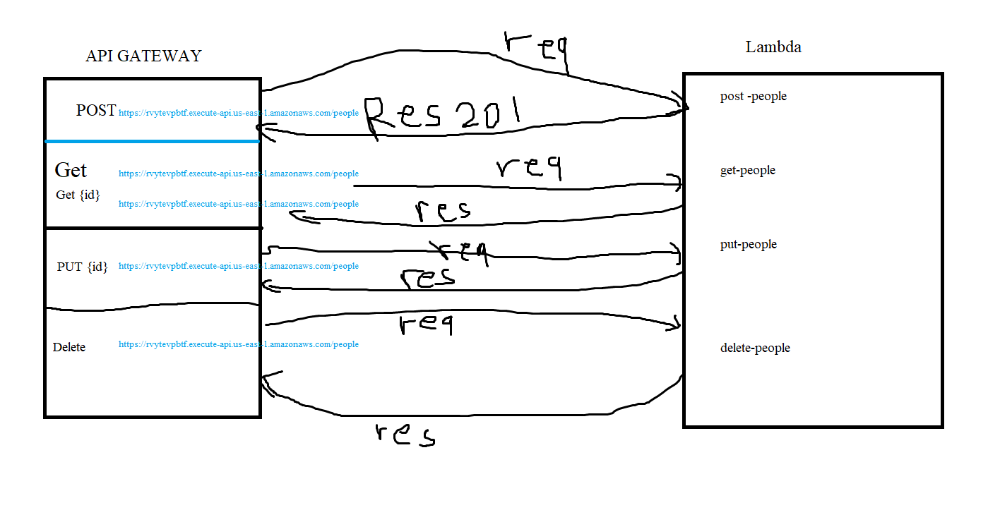

# Dynamo-and-Lambda

[get](https://rvytevpbtf.execute-api.us-east-1.amazonaws.com/people) to get all user
--------------------

[get by id](https://rvytevpbtf.execute-api.us-east-1.amazonaws.com/people)`{id}` to get specific people 

--------------------

[post](https://rvytevpbtf.execute-api.us-east-1.amazonaws.com/people/)`{id}` to add new people

--------------------

[put](https://rvytevpbtf.execute-api.us-east-1.amazonaws.com/people/)`{id}` to update exist people 

--------------------

[delete](https://rvytevpbtf.execute-api.us-east-1.amazonaws.com/people/)`{id}` to delete exist people by id

--------------------

